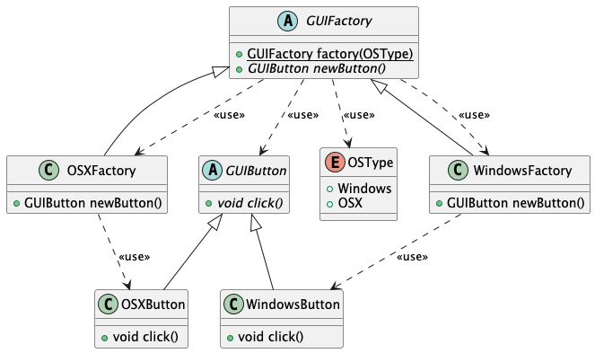

    

In abstract factory pattern, there is usually a creating method(usually defined a static method) 
that is used to create concrete instance inherited from this abstract class, and the return value is this abstract type.
Usually, the instance would not be just created, so there are may some behavior methods which are
typically abstract methods. If these behavior abstract methods have return or arguments value that are 
object, they are usually also abstract class.

#### Abstract Class
##### What it can not do?
1. it can not be instantiated 
2. it can not define an abstract constructor
3. it can not define a static abstract method

##### What is can do?
1. it can define abstract and concrete method
2. it can define a constructor
3. it can have attributes
4. it can define static method

