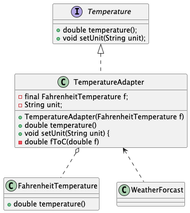

An Adapter implements the interface required by clients
by delegating requests to the legacy implementation (the adaptee)
and performing any necessary conversions.

#### Decoupling 
between clients
and actual running
implementation.

#### Change
changing implementation (legacy class)
or changing the client interface
only requires changing the
adapter.
#### Reusability
all code that works
with the legacy class (such as
tests) can still be used without
changes.