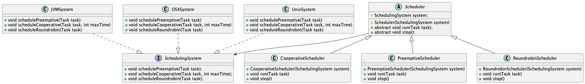

A Bridge decouples the main abstraction implemented by a class
from implementation details and their variants.

Specifically, orthogonal classifications are decoupled: one is modeled
directly by inheritance, the other is combined by delegation.

#### Abstraction/separation of concerns
decouple two
classifications.
#### Change
adding a new category only requires to add
one class; implementors can
be changed at run time.
#### Direct mapping
decoupling two classifications also makes
the design abstraction match
more directly the problem
domain.