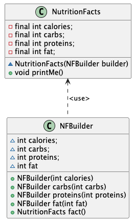

#### Loose coupling/separation of concerns
The product checks
consistency constraints, while
the builder provides a
convenient interface to clients
to easily construct consistent
products.
#### Change
A builder for a heir of
the product can inherit from the
product’s builder; adding one
attribute in the product requires
only to add one method (and
attribute) in the builder.
#### Testability
it’s easy to test the product in isolation.

#### For builder class, why this is set protected access?
* First of all, because these fields don't want to be accessed by users, they are
just belong to builder which is a tool, is meaningless to business. So they should not be public.
If users want to access the field, they should consider accessing these through NutritionFacts class.
* Next, It can be set private, because it is used in class NutritionFacts. Usually, the two classes will
appear together(i.e. in same package), so it should be protected access.

#### For product class (NutritionFacts), why the constructor is set protected access?
Because, this constructor is only visible to builder.

#### Other optional solution
Implement builder class as an inner class in product class.