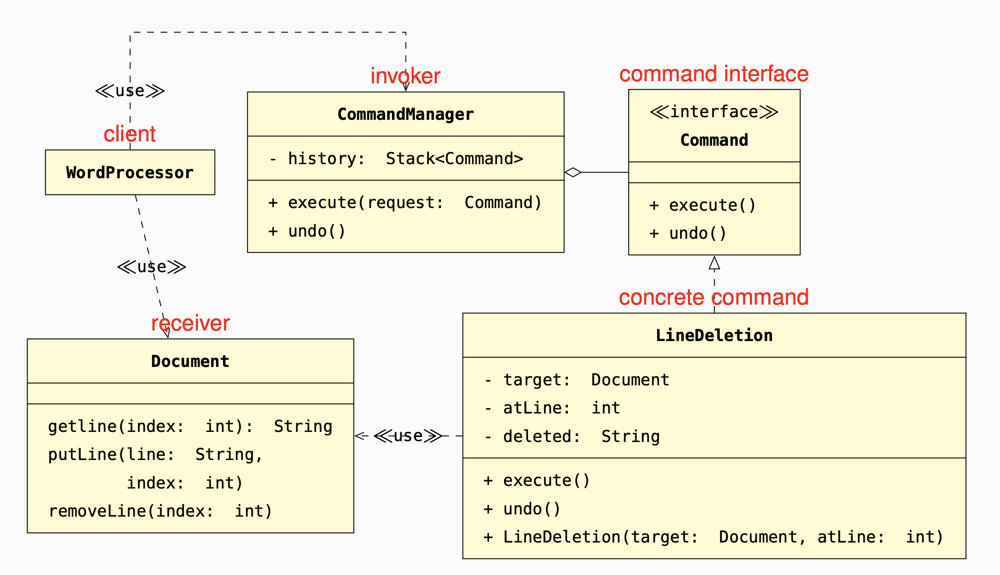

A Command encapsulates the execution of each operation.
A separate Invoker delegates operations to command objects
in response to client actions, while keeping track
of the history of executed commands.

#### Change: 
adding a command requires adding just one class.
#### Decoupling: 
command objects decouple the domain-specific
definition of an operation from
when and how it is executed.
#### Modifiability: 
adding more complex undo/redo strategies
only requires modifying the
invoker.