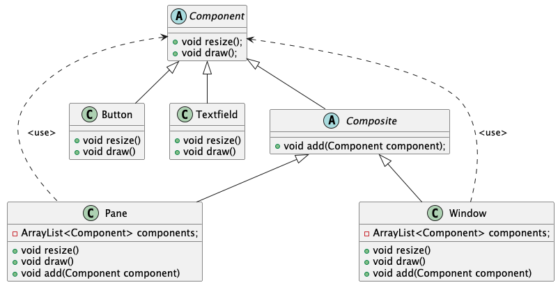

#### Abstraction
uniform interface
to access components.
#### Information hiding/single choice
clients are oblivious to
which components are
composite (except when they
build composites).
#### Modularity
component hierarchy and container
features seamlessly combined.