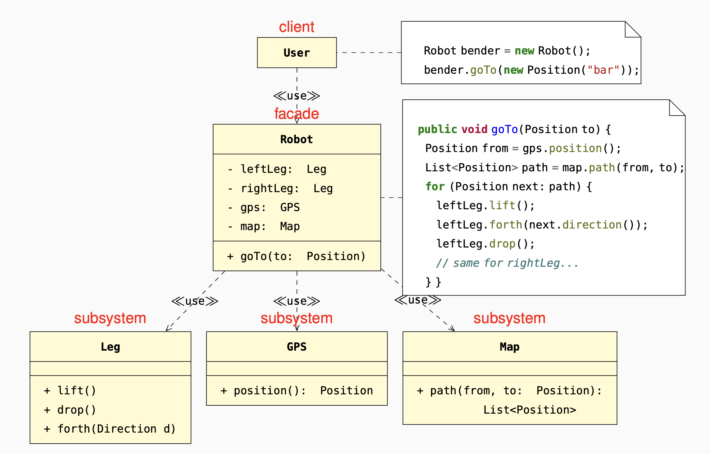

### Information hiding
clients deal with a simple interface that
hides all implementation
complexity.
### Understandability
the facade’s simple interface reduces the
complexity of writing clients.
### Extensibility
if the facade is the only available interface to
the subsystems, it may restrict
their extensibility and reusablity.