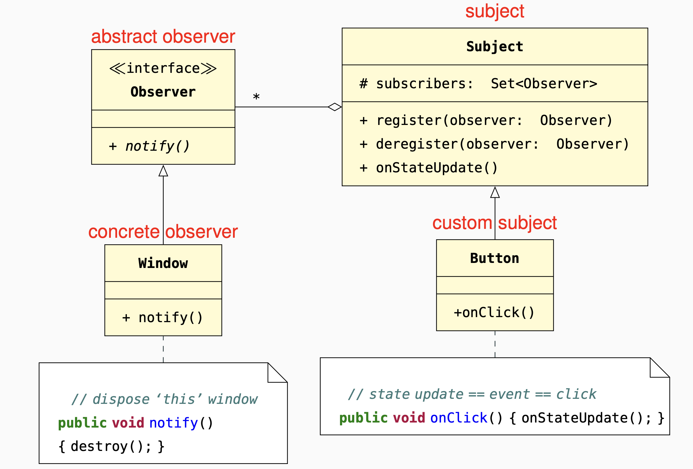

A Subject keeps a list of objects that depend on it,
and notifies them of any state changes.
Each dependent object is an Observer of the subject,
which reacts to notifications from the subject.

#### Change: 
adding a new observer or kind of observer
does not require changing the
subject.
#### Decoupling: 
registration (subscription) and notification
(publication) are decoupled in time (asynchronous).
#### Coupling: 
there is a certain degree of coupling between
subject and observer – the
subject needs to know the
observer’s interface; if the
latter changes, the former may
have to change too.