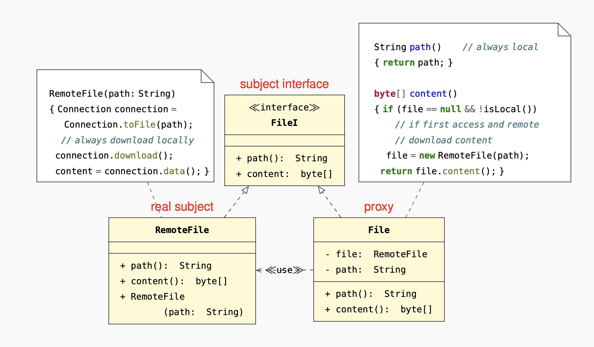

#### Information hiding: 
the proxy hides implementation details
thus simplifying access.
#### Single choice
the information about the kinds of proxied
objects (e.g., distributed vs.
local files) is only represented
in one part of the class
hierarchy.
#### Modifiability
if the proxied classes change behavior, only
the proxy implementation has
to be modified accordingly.