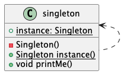

### Information hiding
Clients can
rely on the singleton’s
properties without knowing
how it’s implemented.
### Change
If in the future multiple
instances of a singleton class
are allowed, clients need no
modifications – only simplifying
the Singleton implementation.

#### Implementation of singleton:
##### Lazy initialization
1. Put keyword "final" in front of singleton class to make sure it can't be inherited from.
2. The get instance method must be static. Since it's lazy, so there must be a static field saving initialized singleton instance.
3. The default constructor must be set private in case user can instantiate one.
4. In the lazy get instance method's body, we should make sure create singleton instance thread safety. TO add "synchronized" method, and double-check null.
5. The static instance field should be after keyword "volatile", this keyword makes sure read and wrrite action is thread safety in level of instruction.

##### Using enum structure
1. Enum type is thread safety naturally.
2. Enum values also can have fields, methods and constructors.
3. When enum type classes have constructors, the enum entries should in the format "type(argValue)" to call constructor, and the enum entry itself is a instance of this enum class.
