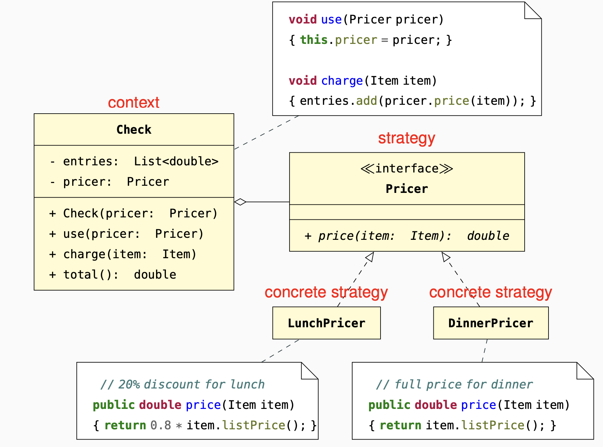

A Strategy is the specific implementation of an algorithm.
A Context delegates to the strategy part of its computation,
and allows its clients to switch strategies.

#### Decoupling: 
the context is independent of the algorithm
implemented by strategies.
#### Single choice: 
the information about the available strategies
is encoded only in their
inheritance hierarchy.
#### Testability: 
the context can be tested independent of the
strategies by providing a stub
implementation of the strategy.