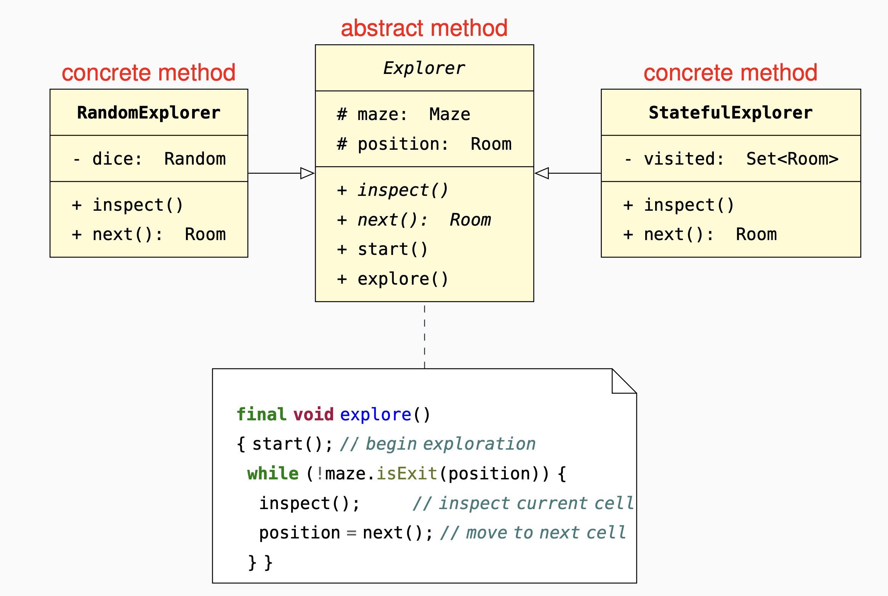

An abstract Template Method defines an overall algorithmic structure
whose steps are delegated to individual abstract methods
that can be implemented differently in descendant classes.

#### Encapsulation: 
step methods encapsulate implementation
details uniformly in all concrete implementations.
#### Open-closed: 
the overall algorithm is fixed (closed),
while the individual steps are
customizable (open) by inheritance.
#### Testability: 
the general algorithm can be tested
independent of concrete
strategies by writing stubs of
the step methods.