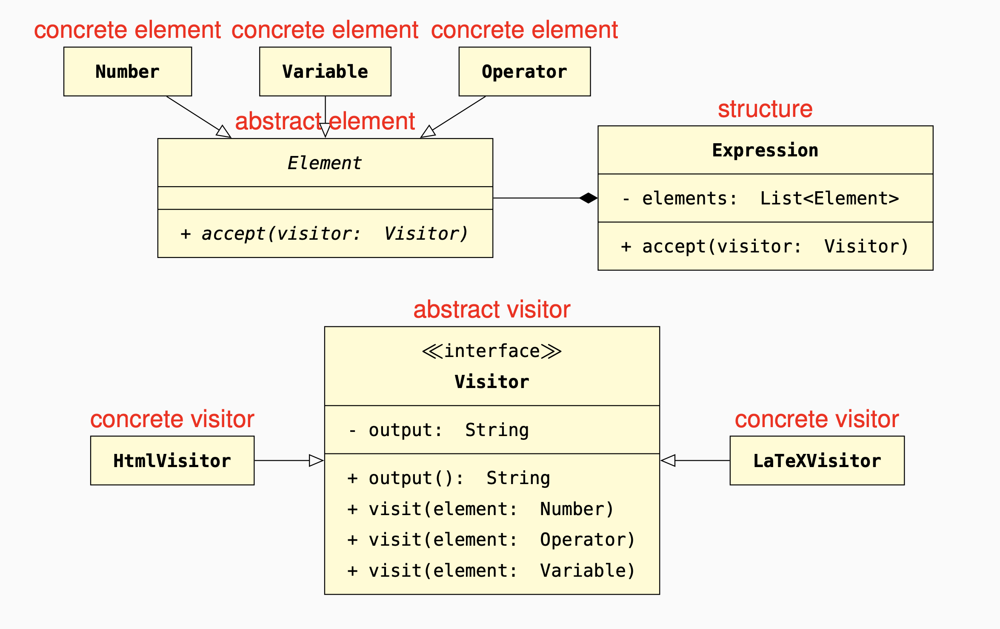

Each Element accepts Visitor objects by receiving them as argument of an accept() method.
An abstract Visitor includes a different method for each element kind;
concrete visitors implement the visitor methods.

#### Decoupling: 
adding or modifying visitors can be done
independently of the structure and its elements.
#### Extensibility: 
adding a visitor only requires adding one visitor
class.
#### Open-closed: 
the structure is completely defined (closed),
but at the same time it is
possible to define new visitor
kinds (open) without affecting
the structure’s elements.